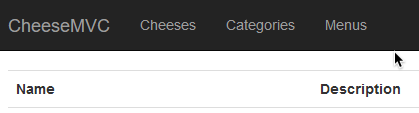
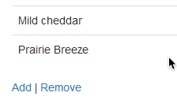

## Part 3: Setting Up a Many-to-Many Relationship

This continues the guided studio in which we set up `CheeseMVC` to work with EntityFrameworkCore. If you've completed [Part 2: Setting Up a One-to-Many Relationship](../one-to-many/) then you're ready to begin this activity.

If you get stuck on any of the steps here refer to the video lesson, or other code within the program that was provided. You'll often find the answers there.

## Creating the Menu Model

This final section of the studio has us set up a many-to-many relationship between two classes. The classes in question will be `Cheese` and `Menu`. We don't have the second of these in place yet, so let's get it set up.

### The Menu and CheeseMenu Classes

Create a new class in `Models\` named `Menu`. Add an `int` property named `ID` and a `string` property named `Name`.

Since the relationship between `Menu` and `Cheese` will be many-to-many, we'll need a class to represent the join table. Create a class named `CheeseMenu` in `Models\`, and add the following properties:

```csharp
public int MenuID { get; set; }
public Menu Menu { get; set; }

public int CheeseID { get; set; }
public Cheese Cheese { get; set; }
```

Be sure to write this code yourself. Don't copy/paste!

In each of `Cheese` and `Menu`, add collections of type `IList` that hold `CheeseMenu` objects. In each case, the collection should be named `CheeseMenus`.

### Update CheeseDbContext

Open up the `CheeseDbContext` class (located in `Data\`). Add `DbSet` properties to use with each of the `Menu` and `CheeseMenu` classes. Also add the following method:

```csharp
protected override void OnModelCreating(ModelBuilder modelBuilder)
{
    modelBuilder.Entity<CheeseMenu>()
        .HasKey(c => new { c.CheeseID, c.MenuID });
}
```

This method will set the primary key of the `CheeseMenu` class and table to be a composite key, consisting of both `CheeseID` and `MenuID`.

## Controller and Views

Create a new controller class named `MenuController`, and add the private field `context`, as you did in previous controllers (don't forget to set up a constructor to initialize the field).

### List Menus

We will now set up the view that displays a list of all menus in the system.

In your new controller, create an action method `Index` that uses `context` to retrieve all menus and display them in a list within the template `Views\Menu\Index.cshtml` (the rest of our templates will be in this same folder, so we'll often omit full paths in this studio). You'll have to create the `Menu\` folder within `Views\`.

Each menu in the list should link to a URL of the form `/Menu/ViewMenu/5`, where 5 could be the ID of any menu. Add these links now, using the tag helpers `asp-controller`, `asp-action`, and `asp-rout-*`, and we'll set up the handler to process these requests in a moment. The numeric ID in the URL should correspond to the `id` parameter. In other words, use `asp-route-id` to set this value.

Within the `Index.cshtml` template, below the list, add a link to the `Add` action of the `Menu` controller. We'll set up this page next.

We'll need a ViewModel to display and process the form that allows the user to create a new menu. Create `AddMenuViewModel` in `ViewModels\`, with a single public property `Name` that is required, and has the display name "Menu Name" (that is, uses the `[Display(Name="...")]` attribute).

### Display the Add Menu Form

We want to allow users to add new, empty menus via a form. This is our next task.

Start off by adding a title to the page.

```nohighlight
@{
    ViewBag.Title = "New Menu";
}
```

In `MenuController`, create an action method named `Add` that responds to `GET` requests, and which displays the `Add.cshtml` template. The action should also pass in a new `AddMenuViewModel` object created by calling that class' default constructor. We'll use this object to help render the form.

Within `Add.cshtml`, create a form that displays a single input and has a submit button. Use `asp-for` and `asp-validation-for` to render the label, input, and error display elements. Additionally, the form should use `asp-controller` and  `asp-action` tag helpers to configure the form to post to the `Add` action in the `Menu` controller. Don't forget to declare the VieWModel that we're using with `@model` at the top of the template.

### Process the Add Menu

Once the user submits the form to create a new menu, we need to do the work to create the object and store it in the database.

In `MenuController` create an action named `Add` that responds to `POST` requests. It should accept an `AddMenuViewModel` object passed in via model binding.

Check that the model is valid. If errors exist, render the `Add` view again. If not, create a new `Menu` object with the `Name` value from the ViewModel, add it to `context.Menus`, and save your changes.

Once a new menu has been created, let's display it to the user. Finish this action method by redirectiong to the view for the new menu: `return Redirect("/Menu/ViewMenu/" + newMenu.ID)`. We'll set up this action and view template next.

### View a Menu

Our next set of tasks has us creating functionality that allows the user to view the contents of a given menu.

#### The ViewMenuViewModel

We'll use a ViewModel to package up all of the data needed to display a menu.

Create a ViewModel named `ViewMenuViewModel` that has two properties: a `Menu` named `Menu` and an `IList<CheeseMenu>` named `Items`. In order to get the items that belong to this menu, we'll need to interact with the `CheeseMenu` class, which joins `Menu` to `Cheese`. Thus, we'll pass in a list of `CheeseMenu` objects.

### The ViewMenu Action

With the ViewModel in place, let's turn our attention to the corresponding action.

In `MenuController`, create an action named `ViewMenu` that accepts `GET` requests at URLs like `/Menu/ViewMenu/5`, where 5 can be any menu ID. This should be passed into the action method as an `int` named `id`. Recall that the default routing for MVC applications is `/{Controller}/{Action}/{id}`, so based on the way we set up the links in the last section, this parameter will be passed in properly.

Within the handler, retrieve the `Menu` object with the given ID using `context`. This can be done with the `Single` method of `DbSet`. We'll also need the items associated with the menu. These can be retrieved with the following line:

```csharp
List<CheeseMenu> items = context
        .CheeseMenus
        .Include(item => item.Cheese)
        .Where(cm => cm.MenuID == id)
        .ToList();
```

Use `items` and the menu object you found above, to build a `ViewMenuViewModel` and pass it into the view.

#### The ViewMenu Template

Now we're ready to build the view template for this feature.

Start off by adding a title to the top of the template:

```nohighlight
@{
    ViewBag.Title = "MENU NAME";
}
```

Set the `Title` property to be the value of `Name` for the menu.

Create `ViewMenu.cshtml`. It should display the name of the menu as the page title. It should display a list of menu items in a `<ul>` element. Note that you'll need to loop over `Model.Items`, which contains `CheeseMenu` objects. Thus, to get the actual `Cheese` objects, you'll need to use the `Cheese` property of each `CheeseMenu`. This will look something like `@cheseMenu.Cheeses.Name`.

Below the list, add a link to the `AddItem` action of the `Menu` controller, with `asp-route-id=@Model.Menu.ID`. This will create URLs like `/Menu/AddItem/5`, where 5 is a menu ID, which will link to a form to add items to the given menu. We'll set up that code next.

## Add Menu Items

Within `MenuController`, create an action named `AddItem` that responds to `GET` requests and takes a single input parameter: `int id`. Within the action, retrieve the menu with the given ID via `context`.

### AddMenuItemForm

Create a ViewModel named `AddMenuItemViewModel` to be used to render and process the form to add a new item to a given menu.

We'll need two integer properties to process our form: `cheeseID` and `menuID`. And we'll need two properties to display the form: a `Menu` property of type `Menu` and a `Cheeses` property of type `List<SelectListItem>`.

Finally, add two constructors: a default no-arg constructor and one that accepts and sets a value for `Menu`, along with an `IEnumerable<Cheese>`. The latter parameter should be used to create `SelectListItem` objects and add to `Cheeses`. This will look something like this:

```csharp
Cheeses.Add(new SelectListItem
{
    Value = cheese.ID.ToString(),
    Text = cheese.Name
});
```

Don't forget to initialize `Cheeses` to an empty list at some point.

The default constructor is needed for model binding to work.

### Rendering the Form

Now, back in `MenuController.AddItem`, create an instance of `AddMenuItemForm` with the given `Menu` object, as well as the list of all `Cheese` items in the database. Pass this ViewModel into the view.

Create a new template, `AddItem.cshtml`, declare the ViewModel at the top, and add a title:

```nohighlight
@{
    ViewBag.Title = "Add Item to Menu: " + Model.Menu.Name;
}
```

The template should contain a form that posts to `/Menu/AddItem` (using tag helpers), and renders the from using the ViewModel, which you'll need to declare at the top of the file. The form should have a single label and input, along with a `<span>` to hold any error messages. Use the appropriate ViewModel properties and tag helpers, as we've done previously.

Below the `<select>`, add this input:

```html
<input type="hidden" name="MenuID" value="@Model.Menu.ID" />
```

This will pass the ID of the menu in the post request, but will not be visible to the user.

Add a submit button, and you're ready to process the form!

### Process the Form

Back in `MenuController`, create another action named `AddItem` that responds to `POST` requests. It should accept a `AddMenuItemViewModel` object via model binding.

Check for errors, rendering the form again again if there are any.

Next, we'll check to see if there is an existing relationship between the `Cheese` and `Menu` specified by the submitted data. If we try to add an entry to a table with a primary key that already exists, we'll get a SQL error, so we need to ensure this doesn't happen. In this case, the primary key of the join table is the combination of `CheeseID` and `MenuID`.

Recall that data being submitted has `CheeseID` and `MenuID` properties, and to check for a relationship between the objects with these IDs we'll need to look for a `CheeseMenu` object with the given IDs. Run the following query:

```csharp
IList<CheeseMenu> existingItems = context.CheeseMenus
        .Where(cm => cm.CheeseID == cheeseID)
        .Where(cm => cm.MenuID == menuID).ToList();
```

If this list is empty, we can go ahead and create a new relationship. Create a new `CheeseMenu` with the ID values in the ViewModel, add it to the corresponding `DbSet` in `context`, and save your changes.

<aside class="aside-warning" markdown="1">
In the lesson video for this project, the code queries for the actual `Cheese` and `Menu` objects represented by the given IDs. This is unnecessary, since if we have the IDs and save to the database, EF Core will be able to pull the correct objects since they are already stored in their respective tables.
</aside>

To finish this handler, let's display the menu that we just added an item to. Redirect to the URL corresponding to the full menu view for this menu. This was created above, and we leave it to you to figure out the correct redirect URL. Note that in the case that the relationship between the given `Cheese` and `Menu` already exists, we don't do anything other than redirect back to the menu.

## Clean Up the Navigation

Let's improve the navigation of our app. In `Views\Shared\_Layout.cshtml` modify the header navigation fragment so that it displays a menu like this:



The *Menus* link should link to the `Index` action of the `Menu` controller.

And in `Views\Cheese\Index.cshtml`, ensure the navigation links below the table look like this:



If you don't have a *Remove* link, create one! It should link to the `Remove` action of the `Cheese` controller.

## Migrations

It's time to create and run the migration to apply our model changes to the database.

Follow the [instructions](../../../videos/intro-to-ef-basics/#migrations) from the initial lesson on EF to create and apply a new migration named `AddMenu`.

Explicitly, once you're at the Powershell prompt in the project directory, run:

```nohighlight
> dotnet ef migrations add AddMenu
```

And then to apply the migration, run:

```nohighlight
> dotnet ef database update
```

## Test!

You made a lot of changes! Great work.

Assuming you don't have any remaining compiler errors, start up your application. (Don't forget to start MAMP first!) Make sure you can create a new cheese object, selecting a pre-existing category. Then make sure the proper category name is displayed in the table on the home page after doing so.

When everything works, you're done! Congrats!

[Turn in your work](../../../assignments/), or tackle one of the Bonus Missions below.

## Bonus Missions

- Add the ability to edit a `Cheese`. To do this, follow the instructions outlined in [Class 8 Prep Exercises](../../../class-prep/8/exercises.html), with the following modifications. In steps 5 and 9, rather than using `CheeseData` to get and save the object, use `context`. And don't forget to call `.SaveChanges()` to make sure your edits are stored in the database!.
