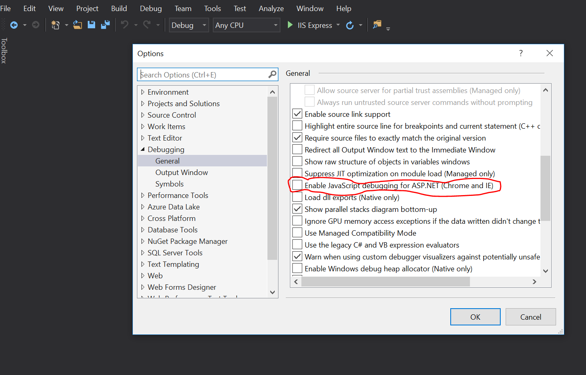

<iframe width="776" height="437" src="https://www.youtube-nocookie.com/embed/2n7keI_E8tE?rel=0" frameborder="0" allowfullscreen></iframe>

## Notes

We begin this lesson by looking at the MVC design pattern and then discussing the .NET framework. MVC stands for Model, View, Controller. The nature of each component is as follows:

* Model: Business objects with a structure that is independent from the framework.
* View: An interface (typically a web page) that displays data to the user.
* Controller: The core "traffic cops" that handle requests and move data. It is the intermediary between the Model and the View components.

Next we build a simple web app.

1. Start by checking your debug settings. In the top menu, select *Debug->Options*. Then in the Options menu select *Debugging->General* and make sure the box next to "Enable JavaScript Debugging for ASP.NET (Chrome and IE)" is **unchecked**.
  
2. Open a new Web project and select *ASP.NET Core Web Application (.NET Core)* and name the project *HelloMVC*. Make sure the two boxes shown in the video are selected (one is to create the directory, the other is to initialize a Git repository). And *be sure to change the file path* so that this project is created in your `lc101` folder.
3. On the next screen, select Web Application for your template.
4. Run the ready-made web application by pressing the green arrow "IIS Express" button. This may take several minutes before you see the web page shown in the video. After you look at the web page that is created, you can stop the application with the red button.
5. Right click on the `Controllers` folder and select *Add->New Item*. Expand the .NET Core section on the left and select *ASP.NET->MVC Controller Class* and name the controller `HelloController`.
6. Replace `return View();` with `return Content("Hello World");`.
7. Run your application again as in step 3. Append this to your url in the browser: `/Hello`. Note that the first portion of the path refers to the controller and the second portion of the path refers to the action method that will be used within that controller. Hence, you can append this to your url instead and it will work the same: `/Hello/Index`.
8. Create another action method in the controller called `Goodbye` that returns the string "Goodbye".
9. Stop and restart your server. Then append the url that appears with the following: `/Hello/Goodbye`.
10. If we want to return HTML at this point, we'll need to pass in an argument specifying that format, e.g.: `return Content("<h1>Hello World</h1>", "text/html");`

## References

- [Handling requests with controllers in ASP.NET MVC Core](https://docs.microsoft.com/en-us/aspnet/core/mvc/controllers/actions)
